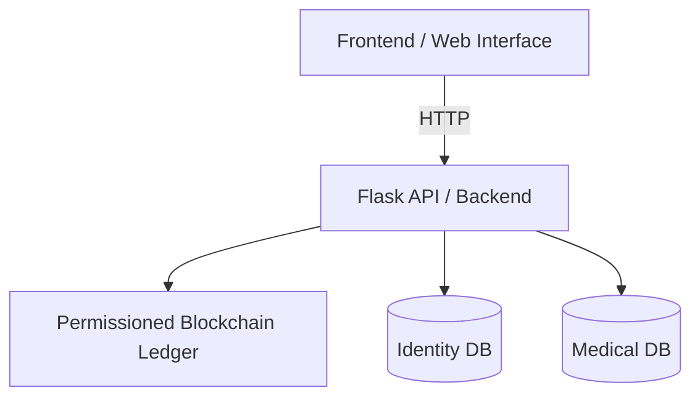

# MedChain – Blockchain-Based Medical Data Access Control

## Overview
MedChain is a prototype system that demonstrates a privacy-preserving medical data access control architecture. The system enforces permanent separation of identity data and medical records, allowing temporary correlation only through explicit patient authorization recorded on a permissioned blockchain ledger.

The primary goal of the project is to improve security, transparency, and auditability in healthcare data access while minimizing privacy risks.


## Key Features

### Dual-Database Architecture
Personal identity data and medical records are stored in separate off-chain databases with no persistent or direct linkage.

### Permissioned Blockchain Ledger
A lightweight blockchain records all access-related events, including access requests, patient approvals or rejections, and authorized data access. All actions are immutable and tamper-evident.

### Patient-Centric Access Control
Medical data can only be accessed after explicit patient approval, enforced through blockchain validation.

### Immutable Audit Trail
Every authorization decision is permanently recorded, enabling transparent auditing and accountability.

### Privacy-Preserving Design
Identity data is never exposed in plaintext. Only cryptographic hashes are stored on the blockchain.

---

## System Architecture


## Design Principles:

No Linkage: No direct or indirect identifiers exist between the Identity and Medical databases.

Authorization: Blockchain is used exclusively for authorization logic and logging.

State Dependency: Data access depends entirely on the current blockchain state.

## Blockchain Design
The blockchain layer is a custom Python-based ledger featuring:

Hash-linked blocks

Proof-of-Work mechanism

Full chain integrity validation

Each block represents a system event. Below is an example ledger entry:
```json
{
  "index": 2,
  "timestamp": "2025-12-11T05:57:36+00:00",
  "proof": 632238,
  "previous_hash": "409071e15bca069152a71d0fdd725abf36f33c506e706c99a025d367072e7671",
  "data": {
    "type": "REQUEST_CREATED",
    "doctorHash": "5f0a9c7f624afc79798e66d7fe80c2f0b85553e2d663fbabd45d4c47645e79b0",
    "patientHash": "2e2b9195e2e8699f016eaa82b7f98af0b9af6b0aa16fac584a92e0532768406c"
  },
  "hash": "d705415f0ba1b043d10ce76bbf0927ab8be7a1c9c5e422256ba383c36ad2db7a"
}
```
## Access Workflow
Request: A doctor submits a request to access patient medical data.

Log: The request is written to the blockchain as a new block.

Review: The patient reviews the pending request.

Action: The patient's Approval or Rejection is recorded on the blockchain.

Validation: The backend validates access permissions via the blockchain state.

Access: Medical data is temporarily released only if valid authorization exists.

## Technologies Used
Backend: Python, Flask

Blockchain: Custom Python implementation

Frontend: React

Storage: JSON-based off-chain databases

Containerization: Docker, Docker Compose

## Installation and Running

### Prerequisites
* Python 3.10+
* Docker and Docker Compose

### Option 1: Run with Docker (Recommended)
```bash
docker compose up --build
```
### Option 2: Run Backend Manually 
```bash
cd backend
pip install -r requirements.txt
python main.py
```

## Project Structure
```text
.
├── backend/
│   ├── main.py
│   ├── blockchain.py
│   ├── data/
│   │   ├── ledger.json
│   │   ├── identity.json
│   │   └── medical.json
├── frontend/
├── docker-compose.yml
└── README.md
```
## Security and Privacy Considerations
Separation: Permanent separation of identity and medical data.

No Linkage: No plaintext identity–medical linkage exists in the storage layer.

Logs: Immutable blockchain-based authorization logs.

Integrity: Tamper detection through cryptographic hash validation.

Disclaimer: This project is a research and demonstration prototype and is not intended for production use in real healthcare environments.

## Author
Sude Teslime Daka
